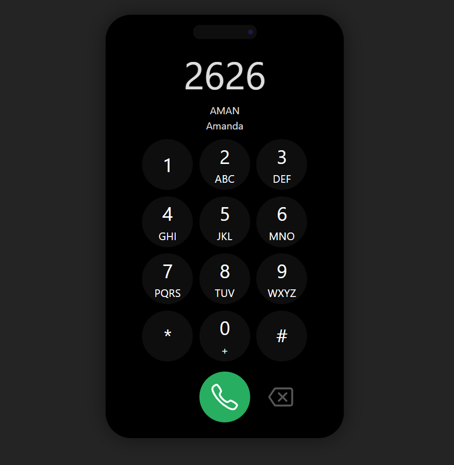

 
<h1 align="center">Buscar Contato</h1>

## Projeto em desenvolvimento ⚙️

Esta é uma aplicação para teste de raciocínio lógico e lógica de programação, onde criei uma interface de discagem que simula um aparelho com números e letras abaixo deles. A ideia é buscar um contato na lista de contatos usando apenas a discagem para formar o nome ou o início do nome do contato desejado. 
     

    

## 🛸 Tecnologias

Esse projeto foi desenvolvido com as seguintes tecnologias:

- HTML e CSS  
- Vue.js 
- JavaScript 
- Git e Github  

## 🖥️ Projeto 

- [Da uma olhada ai](https://cell-phone-two.vercel.app/)

Feito com ♥ by Victor Lima
